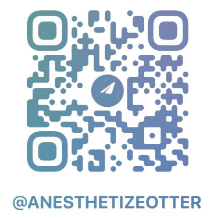

# 技术合伙人招募

我们是一个专注于赔率盘口数据分析与价值投注的团队，通过分析球队状态、庄家盘口、射门、进攻、控球率等数据，对足球滚球（live）进行价值投注。

## 项目背景
历经数年沉淀，我们已实现按半个月为一个周期，并能够赢取90%平台的足球体育赛事，部分平台的 ROI 高达 23% 以上。同时，我们也在开发多个套利模型。

## 招募信息
当前项目人员有限，诚邀一到两位技术人才加入我们的合作，欢迎有能力的优秀人士与 图像识别
- 精通 Python 与 JavaScript 的逆向技术
- 爬虫技术
- 熟悉各类高性能数据库

## 兴趣与态度

我们欢迎对足球充满热情、勇于拼搏、勤劳上进且具备团队合作精神的人才：

- 热爱足球，对于行业有激情
- 勇于拼搏，勤劳上进，做事用心
- 具备团队合作精神和良好的沟通能力

## 加入我们

- 享受团队成长带来的红利
- 年收入百万，欢迎对梦想有追求的人才加入

如果您对这个项目也非常感兴趣，且热爱，请联系我。期待与您共同开创未来！

## 联系方式

- 微信：jjjmmm6648
- Telegram：[@anesthetizeotter](https://t.me/anesthetizeotter)

